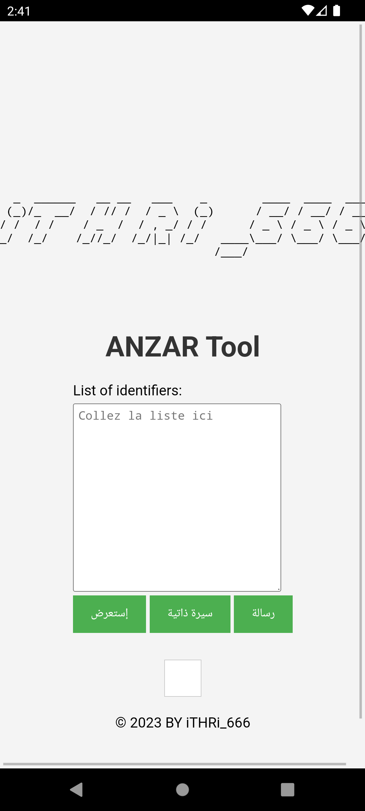

# ANZ# ANZAR: أداة تطبيق البيانات لنظام أندرويد

## مقدمة
أداة ANZAR هي أداة قوية تم دمجها وتخويلها لتطبيق البيانات من نظام معقد إلى تطبيق Android بطريقة فعالة وسهلة الاستخدام. يتميز التطبيق بواجهة مستخدم سهلة الاستخدام وكلمة مرور قوية لضمان الأمان. تم تطوير هذه الأداة لأغراض تعليمية فقط وليست لأي استخدام آخر. المستخدم مسؤول عن استخدامه بشكل قانوني وملتزم بالقوانين المحلية.

## كيفية الاستخدام
1. قم بتثبيت التطبيق على جهازك الذي يعمل بنظام Android.
2. افتح التطبيق وأدخل كلمة المرور: `iTHRi_666`.
3. قم بإدخال رقم طلب العمل الخاص بك الذي تم الحصول عليه من الوكالة المحلية للتشغيل الجزائرية.
4. انتظر حتى يتم تطبيق البيانات بنجاح إلى التطبيق.

## المتطلبات
- جهاز يعمل بنظام Android
- اتصال بالإنترنت

**ملاحظة:** يتطلب تشغيل التطبيق اتصالًا مباشرًا بالإنترنت، ولن يعمل في حالة استخدام VPN أو خارج الجزائر.

## التركيب
قم بتنزيل ملف APK من مستودع الأداة وثبته على جهازك.

## وصف
تعتبر ANZAR أداة Android مبتكرة تسهل عملية تطبيق البيانات من مصادر معقدة إلى تطبيق Android بطريقة سريعة وآمنة. يوفر التطبيق واجهة مستخدم بديهية وكلمة مرور قوية لضمان سلامة البيانات.

## مساهمة
نرحب بالمساهمات من المطورين المحليين في تطوير ANZAR. إذا كنت ترغب في المساهمة، يرجى فتح issue أو إرسال pull request.

## ترخيص
ترخيص MIT. راجع ملف LICENSE للمزيد من المعلومات.

# ANZAR: Outil d'application de données pour Android

## Introduction
ANZAR est un outil puissant intégré et autorisé pour appliquer des données d'un système complexe à une application Android de manière efficace et facile à utiliser. L'application se distingue par une interface utilisateur conviviale et un mot de passe fort pour garantir la sécurité. Cet outil a été développé à des fins éducatives uniquement et l'utilisateur est seul responsable de l'utilisation légale de l'outil, conformément aux lois locales.

## Comment l'utiliser
1. Installez l'application sur votre appareil Android.
2. Ouvrez l'application et entrez le mot de passe : `iTHRi_666`.
3. Saisissez le numéro de demande d'emploi que vous avez obtenu de l'agence locale de l'emploi en Algérie.
4. Attendez que les données soient appliquées avec succès dans l'application.

## Exigences
- Un appareil Android
- Une connexion Internet

**Remarque:** L'application nécessite une connexion Internet directe pour fonctionner et ne fonctionnera pas avec l'utilisation d'un VPN ou en dehors de l'Algérie.

## Installation
Téléchargez le fichier APK depuis le dépôt de l'outil et installez-le sur votre appareil.

## Description
ANZAR est une application Android innovante qui facilite le processus d'application de données à partir de sources complexes vers une application Android de manière rapide et sécurisée. L'application offre une interface utilisateur intuitive et un mot de passe fort pour garantir la sécurité des données.

## Contribution
Nous accueillons favorablement les contributions des développeurs locaux à l'amélioration d'ANZAR. Si vous souhaitez contribuer, veuillez ouvrir un ticket ou envoyer une demande de fusion.

## Licence
Licence MIT. Consultez le fichier LICENSE pour plus d'informations.
